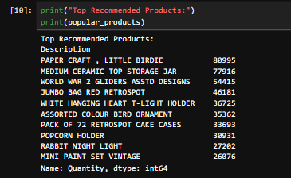
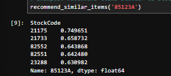

# Online Retail Recommendation System

## Project Overview

This project is a product recommendation system built using Python and the Online Retail dataset. The system analyzes customer purchase behavior and recommends products using different recommendation techniques such as Market Basket Analysis, RFM Analysis, and Item-Based Collaborative Filtering.

## Features

- Data Cleaning and Preprocessing
- Popular Product Recommendation
- Market Basket Analysis
- Association Rule Mining using Apriori Algorithm
- RFM Customer Analysis
- Item-Based Collaborative Filtering
- Product Recommendation using Cosine Similarity

## Technologies Used

- Python
- Pandas
- NumPy
- Matplotlib
- Scikit-Learn
- Mlxtend
- Jupyter Notebook

## Dataset

The Online Retail dataset contains transaction records of a UK-based online retail store.

### Dataset Attributes

- CustomerID
- InvoiceNo
- StockCode
- Description
- Quantity
- UnitPrice
- InvoiceDate
- Country

## Project Workflow

### 1. Data Cleaning
- Removed missing Customer IDs
- Removed cancelled invoices
- Removed invalid quantities and prices
- Created TotalPrice feature

### 2. Popular Product Recommendation
Identified the top-selling products based on purchase quantity.

### 3. Market Basket Analysis
Applied the Apriori Algorithm to discover products frequently purchased together.

### 4. RFM Analysis
Calculated customer metrics:
- Recency
- Frequency
- Monetary Value

### 5. Collaborative Filtering
Used Cosine Similarity to recommend products similar to a selected item.

## Sample Outputs

### Top Recommended Products

### Similar Product Recommendation

## Future Improvements

- Customer-Based Recommendation System
- Interactive Dashboard
- Web Application Deployment
- Personalized Product Recommendations

## Author

Gopika L

BCA Student
